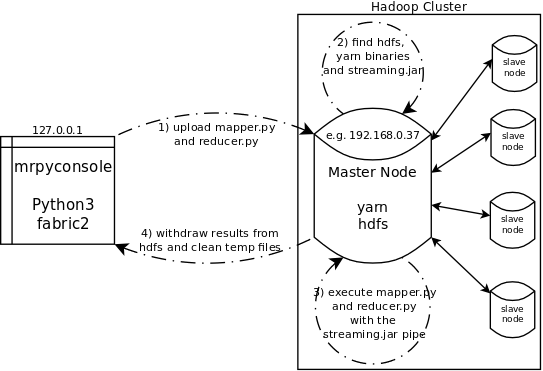

# MRpyconsole

Mrpyconsole is a tool to execute python scripts written to perform MapReduce operations on a Hadoop Cluster without having to upload files and call yarn manually. Basically, it is a python pipe for [Hadoop Streaming](http://hadoop.apache.org/docs/r1.2.1/streaming.html)



## Prerequisite

* python3
* [fabric2](http://www.fabfile.org/) (not the version 1.0)
* [setuptools](https://pypi.org/project/setuptools/)

```
pip3 install setuptools
pip3 install fabric2
```
You'll also need a working hadoop environnement. This includes:

* a running **hdfs** file system (accessible through ``` hdfs dfs -command / ```)
* a running **yarn** (job scheduler aka. ResourceManager)
* a ssh access to the **master-node** (i.e. the one managing the [name node](https://wiki.apache.org/hadoop/NameNode). Logged on the server, you can check this by running ``` jps ``` in your terminal.)
* a **user** with enough priviledges to i) access the server with ssh ii) run hdfs iii) and yarn

```
hadoop@master-node:~$ jps
15124 Jps
5972 NameNode
6238 SecondaryNameNode
8270 ResourceManager
```

## Install


```
git clone https://github.com/ZarebskiDavid/MapreducePyConsole.git
cd MapreducePyConsole
sudo python3 setup.py install
```

This will create a *build*, a *dist* and a *mrpyconsole.egg-info* directory in the MapreducePyConsole folder.

## Usage

You can call mrpyconsole directly from your terminal

```python
mrpyconsole [host] [user] [mapper] [reducer]
 ---- [host]: ip or domain name of your hadoop master node (e.g. 192.168.0.37)
 ---- [user]: ssh user of server (e.g. hadoop)
 ---- [mapper]: path to your python mapper (e.g. /somewhere/over/the/rainbow/mapper.py)
 ---- [reducer]: path to your python reducer (e.g. /somewhere/over/the/rainbow/reducer.py)
```
You'll then be asked to provide:
* the user's password
* an input from your HDFS filesystem
* a folder to write the results (that you can keed on the cloud or erase later on)

## Output

If successful, the script will import the relevant files in your current directory ('mapper.py', 'part-00000', 'reducer.py', 'SUCCESS'). The results of the Map Reduce operations are located in part-00000.


## Uninstall
```
sudo rm -R MapreducePyConsole
```
